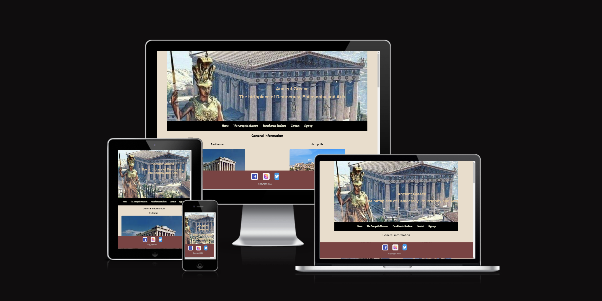
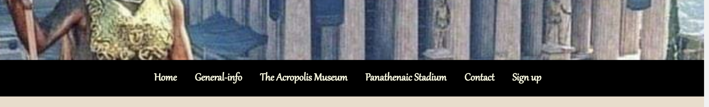
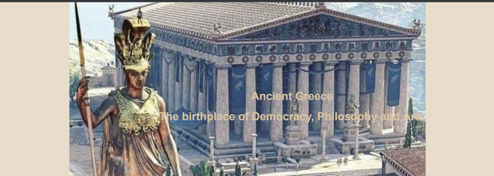
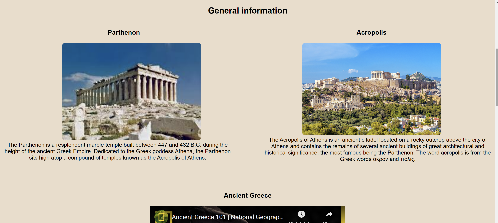
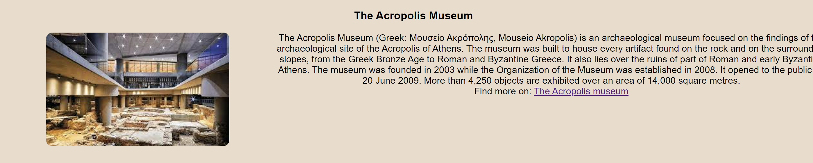
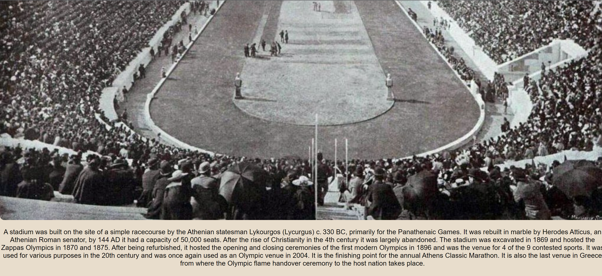
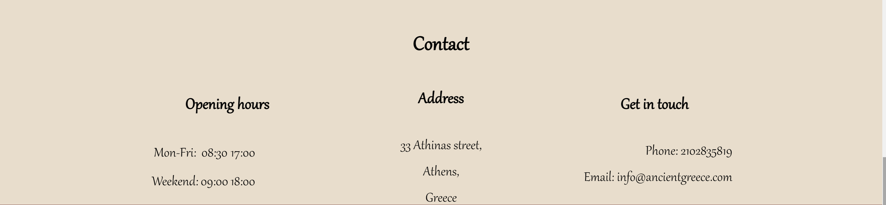
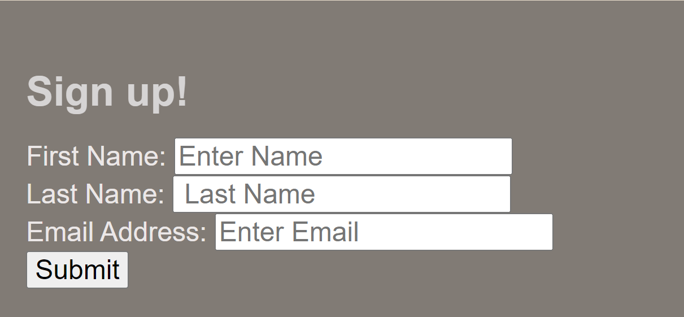
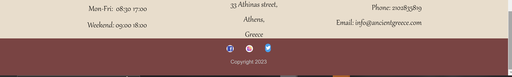

# <b>ANCIENT GREECE</b>

Greece is one of the most ancient and historic countries in the world. 
With this site i would like to saw to the people that they don't know too much
things for Ancient Greece to take a small taste so they can learn more about.

## Features

- <h3><b>Navigation</b></h3>

 

In this section it is a navigation bar so you can go accross the site easily across all devices without having to revert back to the previous page via the ‘back’ button.
It's one horizontal bar with black background and lighter text so you can see the contrast.

1. Home
2. The Acropolis museum
3. Panathenaic stadium
4. Contact
5. Sign up

# <b>Ancient Greece</b>

## The landing page image

At the header you can see a large picture, to grab your attention, with Acropolis in the ancient years and a text that has a small description about Greece that is the birthplace of Democracy, Philosophy, Arts.

 

- <h3><b>Home section</b></h3>

This section has 3 parts, you can see some general info about Acropolis and Parhtenon and pictures from how there are look like now.
Also for the Ancient Greece you can see a video about the history, Democracy, Philosophy, Arts and Maths.

- <h3><b>The Acropolis museum</b></h3>

At this section you can see The Acropolis museum, from the Greek Bronze Age to Roman and Byzantine Greece, marbles and statues.
Also it is a link you can visit to see more information and will open to a new tab for easiest navigation.

- <h3><b>Panathenaic stadium</b></h3>

In this section you can see from where the first modern Olympic games began in 1896 and some general info too.
Also if somebody is an athlete or interested for the games it is nice to know from where they began.

- <h3><b>Contact</b></h3>

At the last section you will find the opening hours also an address, a phone contant and an email if you need to find more info.

- <h3><b>Sign up</b></h3>

In this page we allow to get signed up to Ancient Greece for more information. 
  - You need to submit the full name and email address.

- <h3><b>The Footer</b></h3>

The footer section includes links to the relevant social media Facebook, Instagram and Twitter. The links will open to a new tab to allow for easiest navigation.
The footer is valuable to the user as it encourages them to keep connected via social media.

<h2><b>Testing</b></h2>

- I tested and that page works in different broswsers, Chrome, Safari, Firefox.

- I confirm that this project is respinsive, looks good and functions on all standard screen sizes using the devtools device toolbar.

- I confirmed that the navigation, Home, The Acropolis museun, Panathenaic stadium, Contact and Sign up are all readable and easy to understand.

<h2><b>Validator Testing</b></h2>

- HTML
     - No errors were returned when passing through the official W3C validator
- CSS 
     - No errors were found when passing through the official (Jigsaw) validator

<h2><b>Unfixed bugs</b></h2>

   No  bugs

   <h2><b>Deployment<b></h2>

 - The site was deployed to GitHub pages. The steps to deploy are as follows:
 - In the GitHub repository,navigate to the Settings tab
 - From the source section drop-down menu, select the Master Branch
 - Once the master branch has been selected, the page will be automatically refreshed with a detailed ribbon 
   display to indicate the successful deployment.
 - The link can be found: https://eirinichalatsiadou.github.io/project1/

<h2><b>Credits</b></h2>

 <h3><b>Content</b></h3>

- All the texts for the Home page, The Acropolis museum, Panathenaic stadium was taken from Wikipedia.
   - https://en.wikipedia.org/wiki/Acropolis_of_Athens
   - https://en.wikipedia.org/wiki/Ancient_Greece
   - https://en.wikipedia.org/wiki/Acropolis_Museum
   - https://en.wikipedia.org/wiki/Panathenaic_Stadium
   - https://www.history.com/topics/ancient-greece/parthenon#:~:text=The%20Parthenon%20is%20a%20resplendent,as%20the%20Acropolis%20of%20Athens.

- The video for Ancient Greece (Home page) was taken  from Specific YouTube video (Ancient Greece-National 
  Geographic).

- The link for The Acropolis museum (Home page) was taken from the official website "The Acropolis museum".

<h3><b>Media</b></h3>

- The icons for my project was taken:
   - https://en.wikipedia.org/wiki/Parthenon
   - https://www.onthegotours.com/blog/2022/04/6-places-to-visit-in-athens-after-the-acropolis/
   - https://www.greece-is.com/exploring-the-ancient-city-beneath-the-acropolis-museum/
   - https://greekreporter.com/2021/04/08/the-first-modern-olympics-are-held-in-greece-in-april-1896/
   - https://scontent.fdub5-1.fna.fbcdn.net/v/t39.30808-6/302179856_447158564095640_7942190910465697263_n.jpg?_
   - https://ilovepatrida.com/%CE%B5%CE%BB%CF%8D%CF%84%CE%B7%CF%82-%CE%BA%CE%B1%CE%B9-%CE%B5%CE%BB%CE%B5%CF%85%CF%83%CE%AF%CE%BD%CE%B9%CE%B1-%CE%BC%CF%85%CF%83%CF%84%CE%AE%CF%81%CE%B9%CE%B1-%CE%BC%CE%B5-%CF%84%CE%B7%CE%BD-%CE%BC/

- The icons for the footer (social media) were taken from Google.

